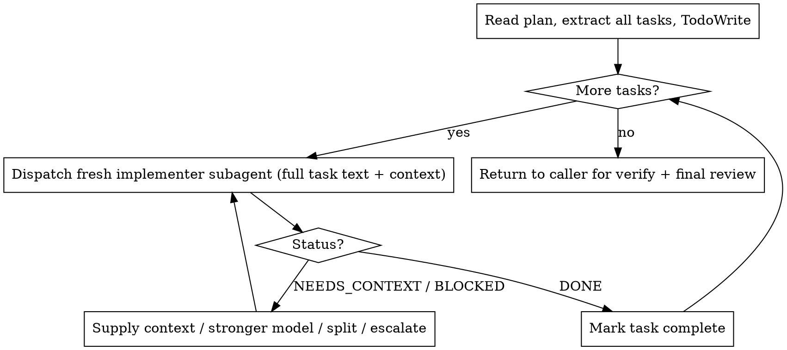

# Subagent-Driven Implementation + Worktree Isolation for `go` — Implementation Plan

> **For agentic workers:** REQUIRED SUB-SKILL: Use superharness:subagent-driven-development (recommended) or superharness:executing-plans to implement this plan task-by-task. Steps use checkbox (`- [ ]`) syntax for tracking.

**Goal:** Add an Isolate phase (git worktree by default) and subagent-driven Phase 2 implementation to superharness's `go` workflow, by porting two adapted skills from superpowers and wiring them in.

**Architecture:** Two new self-contained skill files under the plugin's `skills/` directory, plus edits to `go/SKILL.md` (new Phase 0.5, rewritten Phase 2) and `HARNESS.md` (two table rows). The repo's own PowerShell test suite (`tests/run-tests.ps1`) gets a new assertion group that drives each change TDD-style (assert → RED → create/edit → GREEN). Docs (README.md, 技术方案文档.md) are updated last.

**Tech Stack:** Markdown skill files (Claude Code plugin), PowerShell 5.1 test suite (zero-dependency), no Node changes.

**Spec:** `docs/superpowers/specs/2026-06-12-go-subagent-worktree-design.md`

**Conventions (read before starting):**
- Skill files live at `template/plugins/superharness/skills/<name>/SKILL.md`. The installer copies `template/` into a temp project; the test suite asserts against the **installed** copy at `$plugin = <proj>\.claude\superharness\plugins\superharness`.
- Every skill `.md` must use the `superharness:` namespace — **never** `superpowers:`. The suite has a global dangling-reference check (test group 2) that fails if any skill md contains `superpowers:`.
- Run the suite with: `powershell -NoProfile -ExecutionPolicy Bypass -File tests\run-tests.ps1` from the repo root `C:\Users\wangzh\Desktop\资料\AI\superharness`.
- The suite installs fresh each run, so adding a file under `template/` and re-running is the GREEN step — no manual install needed.

---

### Task 1: Test group for the two new skills (RED scaffolding)

This task adds all the new assertions at once so subsequent tasks turn them GREEN one cluster at a time. After this task the suite MUST fail (the skills/edits don't exist yet) — that is the expected RED.

**Files:**
- Modify: `tests/run-tests.ps1` (append a new test group after the last existing group, before the final summary block)

- [ ] **Step 1: Find the insertion point**

Open `tests/run-tests.ps1` and locate the final summary section (it prints the pass/fail totals, e.g. a line containing `=== Results ===` or `$script:Failed`). The new group goes **immediately before** that summary block. If unsure, append after test group 17 (the last `Write-Host "`n[17]...` block).

- [ ] **Step 2: Append the new test group**

Insert this block:

```powershell
# ---------------------------------------------------------------- Test group 18: subagent-driven + worktree skills
Write-Host "`n[18] Subagent-driven implementation and worktree isolation skills"

# using-git-worktrees skill
$wtPath = Join-Path $plugin 'skills\using-git-worktrees\SKILL.md'
Assert-True (Test-Path $wtPath) "ships skills/using-git-worktrees/SKILL.md"
$wtMd = if (Test-Path $wtPath) { Get-Content $wtPath -Raw } else { '' }
Assert-True ($wtMd -match 'git worktree') "worktree skill uses git worktree"
Assert-True ($wtMd -match '(?i)not a git|no git repo|work in place') "worktree skill degrades when there is no git repo"
Assert-True ($wtMd -match '(?i)by default') "worktree skill documents create-by-default for go"

# subagent-driven-development skill
$sdPath = Join-Path $plugin 'skills\subagent-driven-development\SKILL.md'
Assert-True (Test-Path $sdPath) "ships skills/subagent-driven-development/SKILL.md"
$sdMd = if (Test-Path $sdPath) { Get-Content $sdPath -Raw } else { '' }
Assert-True ($sdMd -match '(?i)fresh subagent') "subagent skill dispatches a fresh subagent per task"
Assert-True ($sdMd -match 'superharness:test-driven-development') "subagent skill delegates TDD to test-driven-development"
Assert-True ($sdMd -match '(?i)self-review') "subagent skill keeps per-task review to self-review only"

# go wires both phases in
$goMd3 = Get-Content (Join-Path $plugin 'skills\go\SKILL.md') -Raw
Assert-True ($goMd3 -match 'using-git-worktrees') "go skill delegates isolation to using-git-worktrees"
Assert-True ($goMd3 -match 'subagent-driven-development') "go skill delegates Phase 2 to subagent-driven-development"
Assert-True ($goMd3 -match '(?i)Phase 0.5|Isolate') "go skill adds the Isolate phase"

# HARNESS lists both
$harnessDoc2 = Get-Content (Join-Path $plugin 'HARNESS.md') -Raw
Assert-True ($harnessDoc2 -match 'using-git-worktrees') "HARNESS.md lists using-git-worktrees"
Assert-True ($harnessDoc2 -match 'subagent-driven-development') "HARNESS.md lists subagent-driven-development"
```

- [ ] **Step 3: Run the suite, verify the new assertions FAIL**

Run: `powershell -NoProfile -ExecutionPolicy Bypass -File tests\run-tests.ps1`
Expected: the suite runs to completion and reports FAIL for the group [18] assertions (skills missing, go/HARNESS not yet wired). All previously-passing tests still pass. This is the intended RED.

- [ ] **Step 4: Commit**

```bash
git add tests/run-tests.ps1
git commit -m "test: assert subagent-driven + worktree skills and go wiring (RED)"
```

---

### Task 2: `using-git-worktrees` skill (GREEN for the worktree assertions)

**Files:**
- Create: `template/plugins/superharness/skills/using-git-worktrees/SKILL.md`

- [ ] **Step 1: Create the skill file**

Create `template/plugins/superharness/skills/using-git-worktrees/SKILL.md` with exactly this content:

````markdown
---
name: using-git-worktrees
description: Use when starting feature work that needs isolation from the current workspace, or before executing an implementation plan - ensures an isolated workspace exists, preferring native worktree tools then git, and degrades to working in place when there is no git repo
---

# Using Git Worktrees

## Overview

Make engineering work happen in an isolated, disposable workspace so a run that
goes wrong can be thrown away cleanly. Prefer a native worktree tool; fall back
to a manual `git worktree`; degrade to working in place when the project is not
a git repo.

**Announce at start:** "Setting up an isolated workspace (using-git-worktrees)."

**superharness default:** `go` invokes this for autonomous, auto-committing runs,
so in a git project **create a worktree by default** — do not stop to ask for
consent. Honor an explicit user instruction to work in place if one was given.

## Step 0 — Detect existing isolation

```bash
GIT_DIR=$(cd "$(git rev-parse --git-dir 2>/dev/null)" 2>/dev/null && pwd -P)
GIT_COMMON=$(cd "$(git rev-parse --git-common-dir 2>/dev/null)" 2>/dev/null && pwd -P)
```

- If `git rev-parse` fails (**not a git repo**): announce "No git repo here —
  working in place." Skip to Step 3.
- If `GIT_DIR` != `GIT_COMMON`: you may already be in a linked worktree. Guard
  against submodules first:
  ```bash
  git rev-parse --show-superproject-working-tree 2>/dev/null
  ```
  If that prints a path you are in a submodule — treat it as a normal repo.
  Otherwise you are already isolated: report the path/branch and skip to Step 3.

## Step 1 — Create the isolated workspace

### 1a. Native worktree tool (preferred)

If a native worktree tool is available (a tool named like `EnterWorktree`, a
`/worktree` command, or a `--worktree` flag), use it and skip to Step 3. Native
tools place the directory, create the branch, and clean up for you. Using raw
`git worktree add` when a native tool exists creates state the harness can't see.

### 1b. Git worktree fallback

Only if no native tool is available:

```bash
branch="superharness/<short-task-slug>"
# Ensure the worktree directory is ignored before creating it:
git check-ignore -q .worktrees || { printf '\n.worktrees/\n' >> .gitignore; git add .gitignore && git commit -m "chore: ignore .worktrees"; }
git worktree add ".worktrees/$branch" -b "$branch"
cd ".worktrees/$branch"
```

**If `git worktree add` fails** (permission/sandbox denial): announce the
failure and **work in place** on the current branch, then continue to Step 3.

## Step 3 — Project setup

Auto-detect and run setup for whatever the project uses, e.g.:

```bash
[ -f package.json ]     && npm install
[ -f requirements.txt ] && pip install -r requirements.txt
[ -f Cargo.toml ]       && cargo build
[ -f go.mod ]           && go mod download
```

## Step 4 — Verify a clean baseline

Run the project's test command. If it passes, report ready. If it fails, report
the failures and ask whether to proceed or investigate — you must be able to tell
new breakage from pre-existing breakage.

```
Workspace ready at <path> (worktree | in place)
Baseline: <N> tests passing, 0 failing
```

## Red Flags

| Thought | Reality |
|---------|---------|
| "I'll `git worktree add` even though EnterWorktree exists" | Use the native tool. Raw git creates phantom state. |
| "No git, so I'm stuck" | No. Announce and work in place — never block. |
| "I'll just commit inside the worktree dir" | Verify `.worktrees` is gitignored first. |
| "Baseline tests fail, I'll start anyway" | Report and ask. You can't attribute breakage later. |
````

- [ ] **Step 2: Run the suite, verify the worktree assertions PASS**

Run: `powershell -NoProfile -ExecutionPolicy Bypass -File tests\run-tests.ps1`
Expected: the four `using-git-worktrees` assertions in group [18] now PASS. The dangling-`superpowers:` check (group 2) still passes (the file uses none). The subagent / go / HARNESS assertions still FAIL (not done yet).

- [ ] **Step 3: Commit**

```bash
git add template/plugins/superharness/skills/using-git-worktrees/SKILL.md
git commit -m "feat: add superharness:using-git-worktrees skill"
```

---

### Task 3: `subagent-driven-development` skill (GREEN for the subagent assertions)

**Files:**
- Create: `template/plugins/superharness/skills/subagent-driven-development/SKILL.md`

- [ ] **Step 1: Create the skill file**

Create `template/plugins/superharness/skills/subagent-driven-development/SKILL.md` with exactly this content:

````markdown
---
name: subagent-driven-development
description: Use when executing an implementation plan whose tasks are mostly independent - dispatches a fresh subagent per task to keep the controller's context clean, with per-task self-review and a single final review
---

# Subagent-Driven Development

## Overview

Execute a plan by dispatching a **fresh subagent per task**. The controller (you)
keeps only plan + coordination context; each implementer subagent gets exactly
the task it needs and nothing else. This preserves your context for the long run
and keeps each task focused.

**Announce at start:** "Executing the plan with subagent-driven-development."

**Core principle:** Fresh subagent per task + per-task self-review + one final
review = focused context, fast iteration.

**superharness scope:** Per-task review is **self-review only** — there are no
per-task reviewer subagents. Whole-change quality is gated once, by the caller's
final `superharness:requesting-code-review` pass (`go` Phase 4).

## When to use

- You have a written plan (from `superharness:writing-plans`).
- Its tasks are **mostly independent** (not tightly coupled).
- You are staying in this session.

If tasks are tightly coupled, or the goal is trivial (1–2 steps), skip subagents
and implement inline with `superharness:test-driven-development`.

## Process

1. **Read the plan once.** Extract every task with its full text and surrounding
   context (where it fits, files involved). Create one TodoWrite item per task.
2. **Per task, in order** (never dispatch two implementers in parallel — they
   would fight over the working tree):
   - Dispatch a fresh implementer subagent with the **complete task text +
     scene-setting context**. The subagent does NOT read the plan file — you
     hand it everything.
   - The implementer follows `superharness:test-driven-development`
     (RED → GREEN → REFACTOR → commit), runs that task's tests, self-reviews,
     and commits.
   - Handle the returned status (below). When DONE and clean, mark the TodoWrite
     item complete and move on.
3. **After all tasks**, return control to the caller (`go` Phase 3/4) for the
   full-suite verification and the single final code review.



## Implementer dispatch template

Fill this in and send it as the subagent's prompt (do not point it at the plan
file — hand it the full text):

```
You are implementing ONE task under superharness discipline. Use
superharness:test-driven-development — write the failing test first, watch it
fail (RED), write the minimal code to pass (GREEN), refactor, then commit.

Task: <full task text, verbatim from the plan>

Context you need:
- Where this fits: <one or two sentences>
- Files involved: <exact paths>
- Conventions/patterns to follow: <as needed>

When done, self-review your diff, then report ONE status:
- DONE — implemented, tests green, committed
- DONE_WITH_CONCERNS — done, but I flag: <concern>
- NEEDS_CONTEXT — I need: <what>
- BLOCKED — I cannot proceed because: <why>
Report the test command you ran and its actual result.
```

## Handling implementer status

- **DONE** — mark complete, next task.
- **DONE_WITH_CONCERNS** — read the concern. If it affects correctness or scope,
  resolve it before moving on; if it's an observation, note it and proceed.
- **NEEDS_CONTEXT** — supply exactly what's missing and re-dispatch.
- **BLOCKED** — assess: more context? re-dispatch with it. Needs more reasoning?
  re-dispatch with a more capable model. Too large? split it. Plan wrong?
  escalate to your human partner. Never re-dispatch the same model unchanged.

## Model selection

Use the cheapest model that fits: mechanical 1–2 file tasks with a complete spec
→ a fast model; multi-file integration → a standard model; design judgment or
broad codebase understanding → the most capable model.

## Continuous execution

Do not check in with your human partner between tasks. Stop only for an
unresolvable BLOCKED, genuine ambiguity, or when all tasks are complete.

## Red Flags

| Thought | Reality |
|---------|---------|
| "I'll let the subagent read the plan" | No. Hand it the full task text + context. |
| "Run two implementers at once to go faster" | They'll corrupt the working tree. One at a time. |
| "Skip self-review, the final review will catch it" | Self-review is the per-task gate. Always do it. |
| "BLOCKED — I'll just retry the same way" | Change something: context, model, or task size. |
| "Tasks are coupled but I'll force subagents" | Fall back to inline TDD for coupled work. |
````

- [ ] **Step 2: Run the suite, verify the subagent assertions PASS**

Run: `powershell -NoProfile -ExecutionPolicy Bypass -File tests\run-tests.ps1`
Expected: the three `subagent-driven-development` assertions in group [18] now PASS, and the global dangling-`superpowers:` check still passes. The go / HARNESS assertions still FAIL.

- [ ] **Step 3: Commit**

```bash
git add template/plugins/superharness/skills/subagent-driven-development/SKILL.md
git commit -m "feat: add superharness:subagent-driven-development skill"
```

---

### Task 4: Wire both skills into `go/SKILL.md` (GREEN for the go assertions)

**Files:**
- Modify: `template/plugins/superharness/skills/go/SKILL.md`

- [ ] **Step 1: Insert Phase 0.5 before Phase 1**

In `go/SKILL.md`, find the line `## Phase 1 — Plan` and insert this block immediately before it (with a blank line after):

```markdown
## Phase 0.5 — Isolate

**REQUIRED SUB-SKILL:** `superharness:using-git-worktrees`

Set up an isolated workspace before changing anything. In a git project this
creates a worktree on a new branch **by default** (no consent prompt) so a run
that goes wrong can be discarded cleanly. If the project is not a git repo, or
worktree creation fails, work in place — never block. Everything after this
(plan, trace, implementation, commits) happens in whatever workspace this leaves.

```

- [ ] **Step 2: Replace the Phase 2 body**

Find the current Phase 2 section. Replace from the header `## Phase 2 — Implement (TDD, no exceptions)` through the line ending `no guess-and-patch fixes.` with:

```markdown
## Phase 2 — Implement (TDD, no exceptions)

**REQUIRED SUB-SKILLS:** `superharness:subagent-driven-development` (for plans
with multiple independent tasks) and `superharness:test-driven-development`.

- **Multi-task plan:** delegate to `superharness:subagent-driven-development` —
  it dispatches a fresh subagent per task so this main context stays on plan and
  review. Each subagent does TDD and commits; you coordinate and handle BLOCKED.
- **Trivial goal (1–2 steps) or tightly-coupled tasks:** implement inline here
  with `superharness:test-driven-development` (no subagent overhead).

Either way, every task follows TDD with no exceptions:

1. **RED** — write the failing test first. Run it. Confirm it fails for the expected reason.
2. **GREEN** — write the minimal implementation. Run the test. Confirm it passes.
3. **REFACTOR** — clean up while keeping tests green.
4. **Commit** with a descriptive message.

If implementation code was written before its test: delete it, write the test, start over.
If anything behaves unexpectedly, switch to `superharness:systematic-debugging` —
no guess-and-patch fixes.

> Trace note: implementer subagents do not write trace markers. The main agent
> still writes `outcome.json` in Phase 3 and the Stop hook records the round, so
> tracing is unchanged.
```

- [ ] **Step 3: Run the suite, verify the go assertions PASS**

Run: `powershell -NoProfile -ExecutionPolicy Bypass -File tests\run-tests.ps1`
Expected: the three `go` assertions in group [18] now PASS. The existing go-skill assertions (group 2: `$ARGUMENTS`, `RED|failing test`; group 15: `task.json`, `outcome.json`, `task_status`; group 17: `one active`) still PASS — confirm none regressed. Only the two HARNESS assertions remain FAIL.

- [ ] **Step 4: Commit**

```bash
git add template/plugins/superharness/skills/go/SKILL.md
git commit -m "feat: go adds Isolate phase and subagent-driven Phase 2"
```

---

### Task 5: List both skills in `HARNESS.md` (GREEN for the HARNESS assertions)

**Files:**
- Modify: `template/plugins/superharness/HARNESS.md`

- [ ] **Step 1: Add two rows to the Available Skills table**

In `HARNESS.md`, find the row beginning `| `superharness:writing-plans` |` and insert these two rows immediately after it:

```markdown
| `superharness:using-git-worktrees` | Starting feature work that needs an isolated workspace, before implementation (go Phase 0.5) |
| `superharness:subagent-driven-development` | Executing a multi-task plan with independent tasks in the current session (go Phase 2) |
```

- [ ] **Step 2: Run the full suite, verify ALL of group [18] passes**

Run: `powershell -NoProfile -ExecutionPolicy Bypass -File tests\run-tests.ps1`
Expected: every assertion in group [18] PASSES and the suite reports 0 failures overall.

- [ ] **Step 3: Commit**

```bash
git add template/plugins/superharness/HARNESS.md
git commit -m "docs(harness): list using-git-worktrees and subagent-driven-development"
```

---

### Task 6: Update README.md and 技术方案文档.md

No test covers docs; verification is by re-reading the changed sections.

**Files:**
- Modify: `README.md`
- Modify: `技术方案文档.md`

- [ ] **Step 1: README — add two rows to the 内含技能 table**

In `README.md`, find the 内含技能 table (rows like `| `superharness:writing-plans` | superpowers（适配） | ... |`). After the `writing-plans` row, add:

```markdown
| `superharness:using-git-worktrees` | superpowers（适配） | 动代码前需要隔离工作区(go Phase 0.5) |
| `superharness:subagent-driven-development` | superpowers（适配） | 执行多任务计划、任务相互独立时(go Phase 2) |
```

- [ ] **Step 2: README — update the `go` phase description**

Find the `go` 技能五阶段 description (the numbered list under `### 3. 执行任务`). Replace the "实现" bullet and add an "隔离" step so it reads:

```markdown
1. **理解** —— 探索代码、确认目标，必要时一轮澄清
2. **隔离** —— `using-git-worktrees`：git 项目默认建 worktree/分支隔离，非 git 则原地
3. **计划** —— `writing-plans`：拆成 2-5 分钟的 TDD 小任务，存到 `superharness/plans/`
4. **实现** —— 多任务计划委托 `subagent-driven-development`（每任务派新子代理，主上下文只留计划与协调），琐碎任务主代理内联 `test-driven-development`；均严格红-绿-重构-提交，出问题转 `systematic-debugging`
5. **验证** —— `verification-before-completion`：跑完整测试套件，贴出真实输出
6. **审查** —— `requesting-code-review`：派子代理审查 diff，严重问题阻塞收尾
```

- [ ] **Step 3: README — update the 仓库结构 skills line**

Find the line in the 仓库结构 tree mentioning the skills (e.g. `│           └── skills\...   # go + resume + brainstorm + 5 个核心技能`). Change the count/comment to:

```
│           └── skills\...   # go + resume + brainstorm + using-git-worktrees + subagent-driven-development + 5 个核心技能
```

- [ ] **Step 4: 技术方案文档 — update §6 go phase flow**

In `技术方案文档.md` §6, update the `go` 五阶段 mermaid flow to insert the Isolate step after Understand and reflect subagent implementation. Replace the flow's `P1 --> P2` edge region so the chain is:

```
G([go 任务目标]) --> P1["① 理解<br/>探索代码 / 确认目标"]
P1 --> P05["①.5 隔离<br/>using-git-worktrees<br/>默认建 worktree/分支"]
P05 --> P2["② 计划<br/>writing-plans<br/>拆成 2-5 分钟 TDD 小步"]
P2 --> P3["③ 实现<br/>subagent-driven-development<br/>每任务新子代理 · TDD"]
```

(Keep the rest of the flow — debugging loop, verify, review — unchanged.)

- [ ] **Step 5: 技术方案文档 — add the two skills to the §9 directory tree and skill notes**

In §9's directory tree comment for `skills\`, update it to mention the two new skills (mirror README Step 3). Add a one-paragraph note under §6 (or a new §6.1) summarizing: Phase 0.5 isolates via worktree (degrades to in-place when no git); Phase 2 dispatches a fresh implementer subagent per independent task to keep the main context clean, with per-task self-review and a single final review at Phase 4; implementer subagents do not write trace markers, so trace granularity is unchanged.

- [ ] **Step 6: Verify docs read correctly**

Re-read the changed sections of both files. Confirm: two new skill rows present, `go` description shows 6 steps incl. 隔离, repo-structure line updated, §6 flow shows Isolate + subagent, §9 note added. No stale "5 个核心技能" count left where it should now list the new skills.

- [ ] **Step 7: Commit**

```bash
git add README.md 技术方案文档.md
git commit -m "docs: document Isolate phase and subagent-driven implementation"
```

---

### Task 7: Final full-suite verification

- [ ] **Step 1: Run the complete PowerShell suite**

Run: `powershell -NoProfile -ExecutionPolicy Bypass -File tests\run-tests.ps1`
Expected: 0 failures. Paste the final summary line as evidence.

- [ ] **Step 2: Confirm no dangling namespace**

Confirm test group 2's assertion "no skill file references the superpowers: namespace" PASSES (covers both new skill files).

- [ ] **Step 3 (optional but recommended): Smoke-check the Node suite is untouched**

Run: `node --test tests\`
Expected: same result as before this change (no regressions; this change touched no Node files).

---

## Self-Review

**Spec coverage:**
- Component ① using-git-worktrees → Task 2 (+ assertions Task 1). ✓ (default-create, no-git degradation, native-tool preference, baseline)
- Component ② subagent-driven-development → Task 3. ✓ (fresh subagent/task, self-review only, status handling, model selection, continuous, coupling fallback, inlined template)
- Component ③ go Phase 0.5 + Phase 2 → Task 4. ✓ (keyword contracts preserved: `$ARGUMENTS`, RED, task.json/outcome.json/task_status, "one active" untouched)
- Component ④ HARNESS rows → Task 5. ✓
- Component ⑤ tests → Task 1 (+ GREEN verification in each task). ✓
- Component ⑥ docs → Task 6. ✓
- Data-flow/trace note (subagents don't write markers) → captured in go Phase 2 Trace note (Task 4 Step 2) and 技术方案 §6.1 (Task 6 Step 5). ✓
- Degradation table (no git / sandbox fail / trivial / coupled / BLOCKED) → worktree skill Red Flags + subagent status handling. ✓

**Placeholder scan:** Full skill-file contents are inline (no "similar to"); doc edits give exact strings + anchors. The only `<...>` are intentional fill-in slots inside the dispatch/worktree templates (these are template literals the agent fills at runtime, not plan placeholders).

**Type/name consistency:** Skill names used in go/HARNESS/docs (`superharness:using-git-worktrees`, `superharness:subagent-driven-development`) match the `name:` frontmatter and directory names in Tasks 2–3. Assertion regexes in Task 1 match strings present in the Task 2–5 content (`fresh subagent`, `self-review`, `by default`, `no git repo`/`work in place`, `using-git-worktrees`, `subagent-driven-development`, `Isolate`).
