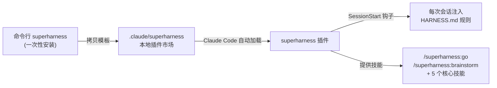
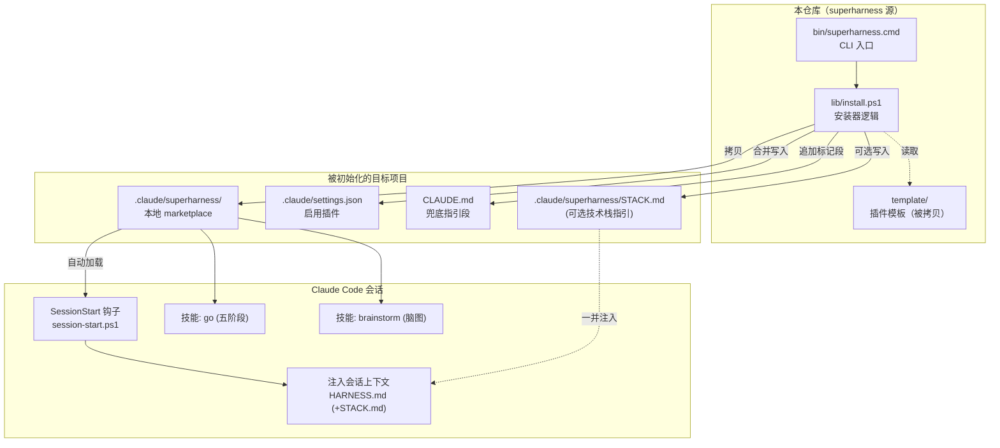
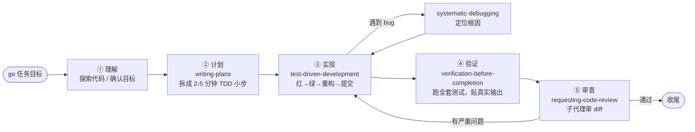
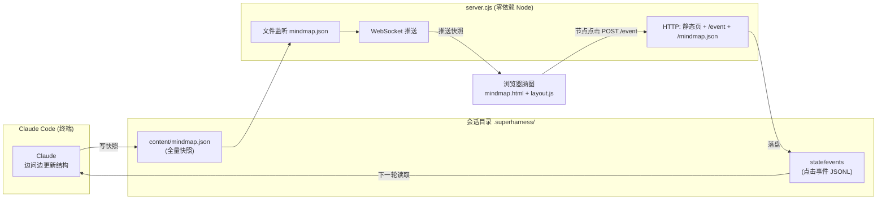
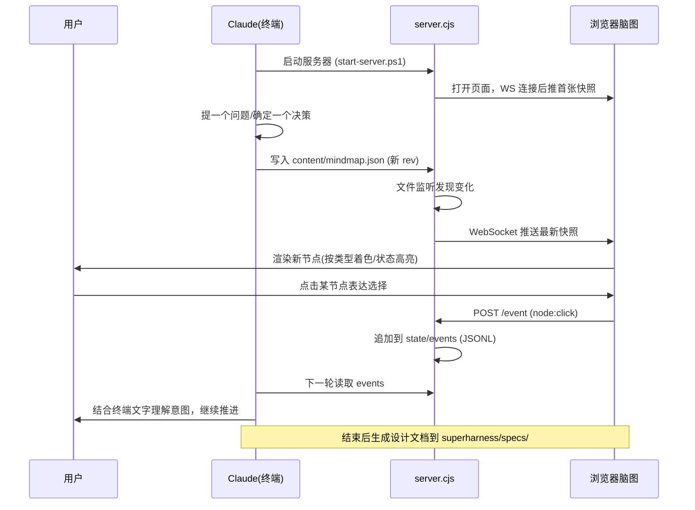
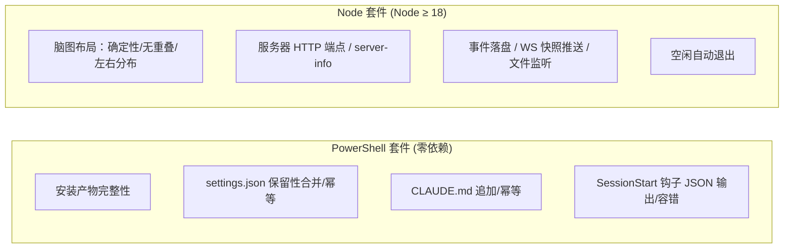
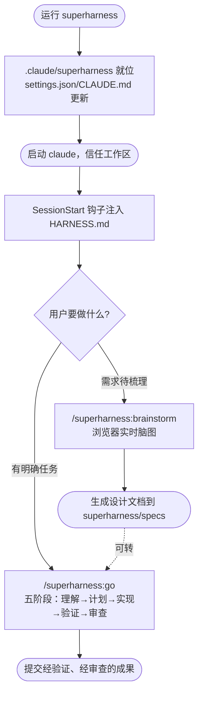

# Superharness 技术方案文档

> 一句话：**Superharness 是给 Claude Code 装的一套"工程纪律外挂"。** 跑一条命令，
> 就能让 AI 在你的项目里按"先写测试 → 系统化调试 → 完成前必须验证 → 代码审查"的
> 规矩干活，并附带一个浏览器实时脑图来梳理需求。

本文用尽量简单的语言讲清楚：它**是什么、怎么装、运行时发生了什么、各部分怎么配合**，
并配有流程图。

---

## 1. 它解决什么问题

默认的 AI 编码助手容易"图快"：不写测试、猜着改 bug、嘴上说"修好了"却没真跑过。
Superharness 把一套硬性纪律以"插件 + 钩子 + 技能"的形式塞进项目，让 AI **每次会话
开始就被强制加载规则**，从而：

| 痛点 | Superharness 的约束 |
|------|---------------------|
| 不写测试 | **TDD 强制**：先写会失败的测试（红）→ 最小实现（绿）→ 重构 |
| 猜着改 bug | **系统化调试**：先定位根因，禁止"试一下"式补丁 |
| 假装完成 | **完成前验证**：必须贴出真实命令输出才能说"done" |
| 无计划乱干 | **先写计划**：3 步以上的任务先拆成 2–5 分钟的小步 |
| 不审查就合并 | **代码审查**：收尾前派子代理审 diff |

---

## 2. 核心概念（30 秒看懂）



三层关系：
1. **CLI 安装器**（`bin` + `lib/install.ps1`）：只跑一次，把"模板"拷进你的项目。
2. **本地 marketplace 插件**（`.claude/superharness`）：Claude Code 启动时自动识别加载。
3. **钩子 + 技能**：钩子负责"每次都注入规则"，技能负责"具体怎么干活"。

---

## 3. 整体架构图



---

## 4. 安装流程（运行 `superharness` 时发生了什么）

CLI 入口 `bin/superharness.cmd` 只是转发，真正逻辑在 `lib/install.ps1`。


**设计要点（为什么这么做）**：
- **幂等**：重复运行只覆盖更新，不破坏已有配置；`settings.json` 用"保留性合并"，
  只加自己的键，不动用户其它配置。
- **标记段**：`CLAUDE.md` 用 `<!-- SUPERHARNESS:BEGIN/END -->` 包裹，便于原地替换升级。
- **可选技术栈**：`--template=frontend|backend|fullstack`（配合 `--stack`）会把对应的
  栈指引拷成 `STACK.md`，供钩子注入。

---

## 5. 会话启动流程（每次打开 Claude Code）

插件的 **SessionStart 钩子**（`session-start.ps1`）保证规则"每次都在"。


**容错设计**：钩子 `$ErrorActionPreference = 'SilentlyContinue'` 且永远 `exit 0`——
一个坏掉的钩子绝不能让用户无法开工。

---

## 6. `go` 技能：五阶段自主工作流

用户输入 `/superharness:go <任务目标>` 后，AI 按固定五步推进，每步对应一个子技能。



每个阶段是一个独立技能文件（`skills/<name>/SKILL.md`），核心内容移植并适配自
[obra/superpowers](https://github.com/obra/superpowers)。

---

## 7. `brainstorm` 技能：浏览器实时脑图

手动运行 `/superharness:brainstorm <主题>` 时，启动一个**零依赖 Node 服务器**，在浏览器
打开实时脑图，边对话边画图。

### 7.1 组件与数据流



### 7.2 一次交互的时序



### 7.3 关键设计

- **消息协议**：Claude → 前端走"写全量快照文件"（含 `rev`/`status`/树形 `root`），
  服务器监听文件变化后 WebSocket 推送；前端 → Claude 走 `POST /event` 落盘 JSONL，
  Claude 下一轮读取。两端通过**文件**解耦，无需复杂双向 RPC。
- **零依赖**：`server.cjs` 自己用 Node 原生 `http` + `crypto` 手写了 WebSocket
  握手与帧编解码（RFC 6455），不装任何 npm 包。
- **自动降级**：没有 Node 时流程退回纯终端脑暴，绝不阻塞。
- **自动退出**：空闲超时（默认 30 分钟）自动关闭，端口随机选取。
- **会话产物**：落在 `.superharness/`（已 `.gitignore`），不污染仓库。

---

## 8. 技术选型与目录

| 部分 | 技术 | 为什么 |
|------|------|--------|
| 安装器 / 钩子 | PowerShell | 目标平台 Windows，免额外运行时 |
| CLI 入口 | `.cmd` 批处理 | cmd / PowerShell 均可直接调用 |
| 脑图服务器 | Node 原生（零依赖）| 免 npm install，开箱即用 |
| 前端脑图 | 纯 HTML + JS（`layout.js`）| 无构建步骤，确定性布局 |
| 插件机制 | Claude Code 本地 marketplace | 项目自带、信任即用，无需全局安装 |

```
superharness\
├── bin\superharness.cmd          # CLI 入口（PATH 上可直接调用）
├── lib\install.ps1               # 安装器逻辑（可测试）
├── template\                     # 被拷进项目的 .claude/superharness
│   ├── .claude-plugin\marketplace.json
│   └── plugins\superharness\
│       ├── .claude-plugin\plugin.json   # 插件清单（superharness: 命名空间）
│       ├── HARNESS.md                   # 会话注入的约束规则
│       ├── hooks\                       # SessionStart 钩子
│       ├── skills\                      # go + brainstorm + 5 个核心技能
│       └── stacks\                      # 6 份技术栈指引（可选）
├── tests\run-tests.ps1           # 安装器/钩子测试（PowerShell）
├── tests\*.test.mjs              # 脑图服务器/布局测试（node --test）
├── setup.cmd / setup.ps1         # PATH 一次性配置
└── README.md
```

---

## 9. 测试策略

项目自身按 TDD 构建，两套测试：



运行命令：

```cmd
:: 安装器 + 钩子
powershell -NoProfile -ExecutionPolicy Bypass -File tests\run-tests.ps1

:: 脑图服务器 + 布局
node --test tests\
```

---

## 10. 环境要求

- **Windows**（安装器与钩子为 PowerShell 实现）
- **Node ≥ 18**（仅 `/superharness:brainstorm` 脑图服务器需要；其余功能不依赖）
- **Claude Code ≥ 2.1.x**（本地 marketplace 插件机制）

---

## 11. 一图总览（从安装到干活）


