# Superharness 技术方案文档

> 一句话：**Superharness 是给 Claude Code 装的一套"工程纪律外挂"。** 跑一条命令，
> 就能让 AI 在你的项目里按"先写测试 → 系统化调试 → 完成前必须验证 → 代码审查"的
> 规矩干活，并附带一个浏览器实时脑图来梳理需求。

本文用尽量简单的语言讲清楚：它**是什么、怎么装、运行时发生了什么、各部分怎么配合**，
并配有流程图。

---

## 1. 它解决什么问题

默认的 AI 编码助手容易"图快"：不写测试、猜着改 bug、嘴上说"修好了"却没真跑过。
Superharness 把一套硬性纪律以"插件 + 钩子 + 技能"的形式塞进项目，让 AI **每次会话
开始就被强制加载规则**，从而：

| 痛点 | Superharness 的约束 |
|------|---------------------|
| 不写测试 | **TDD 强制**：先写会失败的测试（红）→ 最小实现（绿）→ 重构 |
| 猜着改 bug | **系统化调试**：先定位根因，禁止"试一下"式补丁 |
| 假装完成 | **完成前验证**：必须贴出真实命令输出才能说"done" |
| 无计划乱干 | **先写计划**：3 步以上的任务先拆成 2–5 分钟的小步 |
| 不审查就合并 | **代码审查**：收尾前派子代理审 diff |

---

## 2. 核心概念（30 秒看懂）

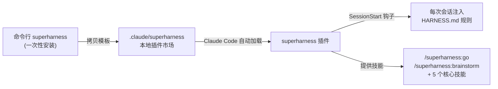

三层关系：
1. **CLI 安装器**（`bin` + `lib/install.ps1`）：只跑一次，把"模板"拷进你的项目。
2. **本地 marketplace 插件**（`.claude/superharness`）：Claude Code 启动时自动识别加载。
3. **钩子 + 技能**：钩子负责"每次都注入规则"，技能负责"具体怎么干活"。

---

## 3. 整体架构图


---

## 4. 安装流程（运行 `superharness` 时发生了什么）

CLI 入口 `bin/superharness.cmd` 只是转发，真正逻辑在 `lib/install.ps1`。

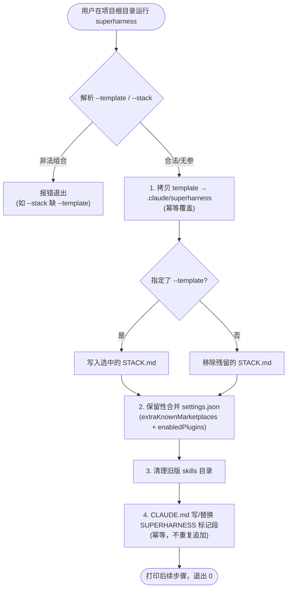

**设计要点（为什么这么做）**：
- **幂等**：重复运行只覆盖更新，不破坏已有配置；`settings.json` 用"保留性合并"，
  只加自己的键，不动用户其它配置。
- **标记段**：`CLAUDE.md` 用 `<!-- SUPERHARNESS:BEGIN/END -->` 包裹，便于原地替换升级。
- **可选技术栈**：`--template=frontend|backend|fullstack`（配合 `--stack`）会把对应的
  栈指引拷成 `STACK.md`，供钩子注入。

---

## 5. 会话启动流程（每次打开 Claude Code）

插件的 **SessionStart 钩子**（`session-start.ps1`）保证规则"每次都在"。

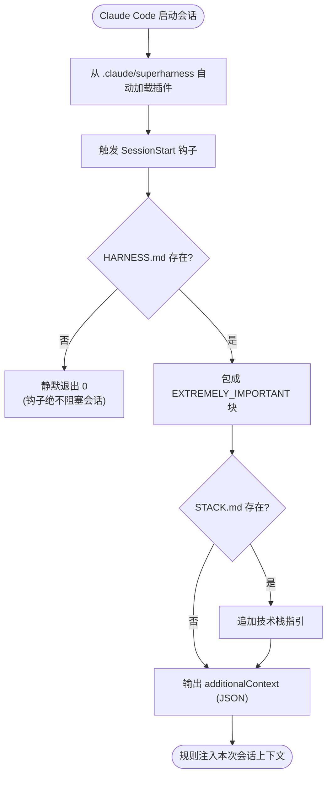

**容错设计**：钩子 `$ErrorActionPreference = 'SilentlyContinue'` 且永远 `exit 0`——
一个坏掉的钩子绝不能让用户无法开工。

---

## 6. `go` 技能：六阶段自主工作流

用户输入 `/superharness:go <任务目标>` 后，AI 按固定六步推进，每步对应一个子技能。

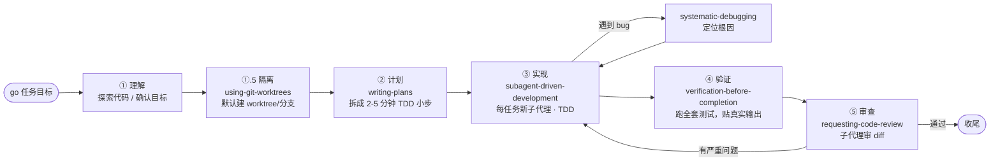

每个阶段是一个独立技能文件（`skills/<name>/SKILL.md`），核心内容移植并适配自
[obra/superpowers](https://github.com/obra/superpowers)。

### 6.1 隔离与子代理实现

- **Phase 0.5 隔离**：`using-git-worktrees` 在 git 项目里默认建 worktree/分支，让自主+自动提交的 `go` 改坏可干净回滚；非 git 或建失败则原地工作，绝不阻塞。
- **Phase 2 子代理实现**：多任务计划委托 `subagent-driven-development`，每个相互独立的任务派一个**全新实现子代理**（带完整任务文本+上下文，不读 plan 文件），主代理上下文只保留计划、协调与审查。逐任务只做自检，质量统一交给 Phase 4 的最终 `requesting-code-review`。
- **与 trace 的关系**：实现子代理**不写 trace 标记**；主代理在各阶段边界用 `Add-RalphTrace` 向 `trace.jsonl` 写执行事件，Stop 钩子按主代理轮次另外追加 `round` 心跳，因此**追踪粒度不变**。附带好处：ralph 状态按 `cwd` 区分，不同 worktree 并发跑 `go` 天然不互踩。

---

## 7. 任务追踪与自动重试：直接构建在 Ralph 状态机制之上

`go` 跑任务时容易"一路向前"，一旦中途失败，重开会话就丢了上下文。这一层把任务过程
持久化进**下文 7.5 的 Ralph 四文件状态**（`superharness/ralph/`），并在失败时**于同一次运行内
自动重试**——不再使用旧的 `superharness/trace/<slug>.json` + `outcome.json` 机制，也不再需要
手动的 `/superharness:resume` 技能（其"复现→定位→改码→验证"闭环已内化进 Phase 3 的自动重试）。

### 7.1 混合式架构：go 写执行事件，Stop 钩子兜底心跳

记录既要**有细粒度**（按执行事件），又要**可靠**（不依赖 Claude 记得做事）。两者分工：

| 谁 | 触发/时机 | 干什么 |
|----|-----------|--------|
| `UserPromptSubmit` hook | 每次用户提交 prompt | 暂存 `{ts, query}` 到 `superharness/ralph/.pending-prompt.json` |
| `go` 工作流（主代理） | Phase 1 / 各阶段边界 | `Set-RalphCurrentTask` 写 `.current-task`、`Initialize-RalphTasks` 写 `task.json`、`Add-RalphTrace` 写 `trace.jsonl` 执行事件、`Set-RalphTaskStatus` 翻子任务状态 |
| `Stop` hook | Claude 交还控制权 | 若 `.current-task` 在，则向 `trace.jsonl` 追加一条 `round` 心跳（detail 取暂存的 query），消费 `.pending-prompt.json` |

**作用范围限定**：只有存在 `.current-task`（即有 `go` 任务在跑）时 Stop 才记录；
普通对话 / 非 go 会话的 `Stop` 一律 no-op，并清掉游离的 `.pending-prompt.json`。

### 7.2 单轮记录的数据流

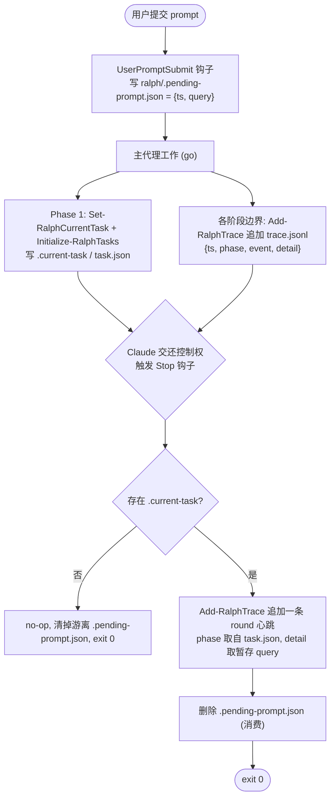

**关键不变量**：`round` 心跳由 hook **无条件**追加——"每一轮都被记录"不依赖 Claude 的记忆；
`go` 主代理的 `Add-RalphTrace` 执行事件是**细粒度增强**，缺失时该轮仍有 hook 的心跳兜底。

### 7.3 成败判定（看 test case）与文件布局

成败由 `go` 在 Phase 3 跑完测试后判定，并即时写进 `trace.jsonl`：

| 该轮情况 | 主代理记录的事件 | 重试动作 |
|---|---|---|
| 跑了测试且全绿 | `verify:success`（detail 含 `test_command`） | `Set-RalphTaskStatus done` + `Reset-RalphRetry` |
| 跑了测试且有失败 | `verify:failure`（detail 含失败用例 + 断言） | `Add-RalphRetry`；未触顶则自动回 Phase 2 |
| 该轮没跑测试（如澄清提问） | 仅 Stop 钩子的 `round` 心跳 | 无 |

落在**目标项目**里（与 `superharness/plans/` 对齐，整目录已由安装器写入 `.gitignore`）：

```
superharness/ralph/
  .current-task        # 活跃任务指针（单一活跃标记）；换任务只重写这一行
  task.json            # 任务清单快照 {status, phase, sprint, tasks[], updated_at}
  trace.jsonl          # 执行流水账，每行一条 {ts, phase, event, detail}（只追加）
  .ralph-state.json    # 重试计数器 {retries, max:5, updated_at}
  .pending-prompt.json # UserPromptSubmit 暂存的 {ts, query}（Stop 消费后删除）
```

> 失败事件**不**落整段对话原文——只记失败用例 + 断言，避免账本膨胀。

### 7.4 同一次运行内的自动重试闭环

Phase 3 跑完**全量**测试后，失败不再等人确认，而是在同一次 `go` 里自动修：

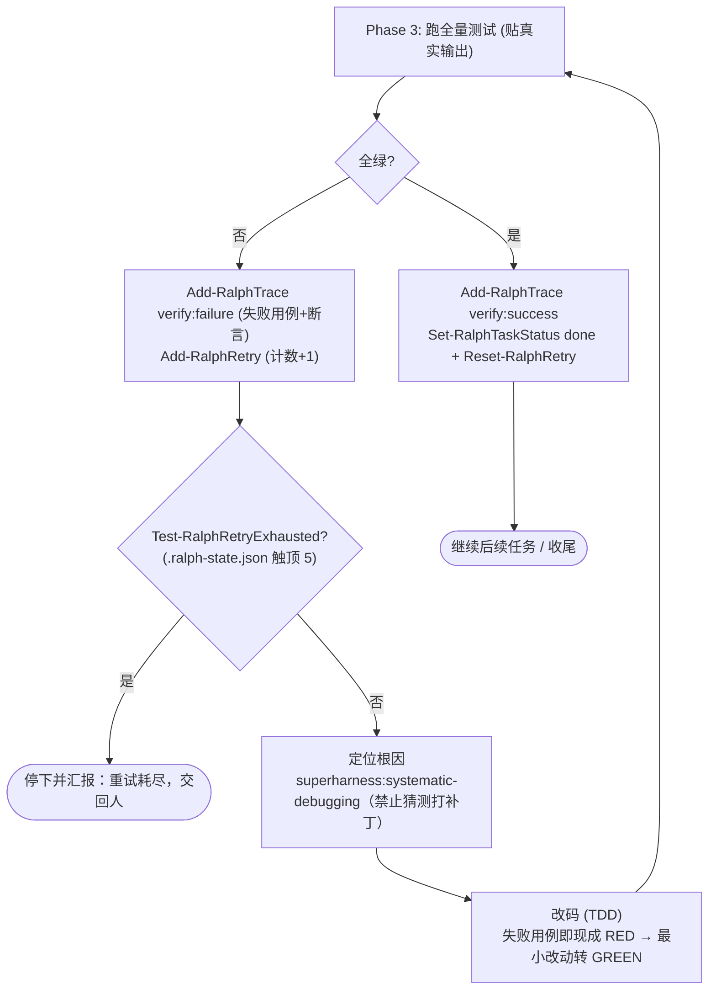

**设计要点**：
- **自动而非盲目**：重试不是重跑用例，而是用失败当 RED，走系统化调试找根因、TDD 最小改动修复。
- **有上限**：`.ralph-state.json` 把重试封顶 **5** 次，触顶即停下汇报，绝不无限循环。
- **可冷启动续跑**：若原 agent 中断，新 agent 靠 `Get-RalphResumeContext` 读回 `.current-task` /
  `task.json` / `trace.jsonl` 末尾 / 重试态，对账 `git diff`（以代码为准）后从第一个未完成子任务接着干。
- **容错**：两个 trace hook 沿用 `session-start.ps1` 的契约——`SilentlyContinue`、包 try、
  **永远 exit 0**、stdin 空/损坏不写文件；ralph 库的 JSON 写盘先写临时文件再原子替换。

### 7.5 Ralph 状态机制：可续跑的四文件状态库

§7 的 hook 追踪解决"每轮自动记录"；当任务长到一个 agent 跑不完、需要"原 agent 中断、
新 agent 冷启动接着干"时，再叠一层**显式状态机**。它是一套零依赖 PowerShell 库
`scripts/ralph-lib.ps1`（dot-source 即用），在 `<项目>/superharness/ralph/` 下维护四个文件：

| 文件 | 作用 | 写入规则 |
|------|------|----------|
| `.current-task` | 一张纸条，写着"现在正在忙哪个任务" | 换任务**只重写这一行** |
| `task.json` | 拆解后的任务清单 `{status,phase,sprint,tasks[],updated_at}`，每个子任务独立带 `status`（`pending`/`in_progress`/`done`） | 原子覆盖；每次写盘刷新 `updated_at` |
| `trace.jsonl` | 流水账，每行一条 `{ts,phase,event,detail}` | **只追加**，从不改写前面的行 |
| `.ralph-state.json` | 重试计数器 `{retries,max,updated_at}` | 原子覆盖，上限 **5** 次封顶 |

为什么 `trace.jsonl` 只追加不改写？**不会写坏**（崩溃最多坏最后一行，前面完好）、**可复盘**
（完整保留执行顺序，出问题一行行倒查）；它与 `task.json` 快照互补——`task.json` 表示"现在长啥样"，
`trace.jsonl` 是"怎么变成这样的"。每个子任务独立的 `status` 是"幂等续跑"的关键：跳过 `done`，
只从第一个没打钩的接着干。

**库函数一览**（均以 `-Root <项目根>` 定位）：

| 文件 | 函数 |
|------|------|
| `.current-task` | `Set-RalphCurrentTask` / `Get-RalphCurrentTask` |
| `task.json` | `Initialize-RalphTasks` / `Get-RalphTasks` / `Get-RalphNextTask`（第一个非 `done`）/ `Set-RalphTaskStatus`（幂等改单项） |
| `trace.jsonl` | `Add-RalphTrace`（追加一行）/ `Get-RalphTraceTail`（读末尾 N 条） |
| `.ralph-state.json` | `Get-RalphRetryState` / `Add-RalphRetry`（自增并封顶 5）/ `Test-RalphRetryExhausted` / `Reset-RalphRetry` |
| 冷启动 | `Get-RalphResumeContext`（一次性装配续跑事实） |

**冷启动恢复流程**（新 agent 脑子空白时照此续跑）：

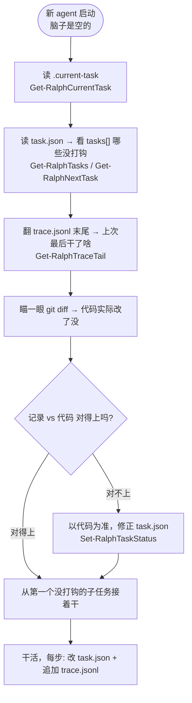

**混合分工**：第 ①～③ 步加重试状态由 `Get-RalphResumeContext` 一次性读成结构化事实（纯文件读取、
可单测）；第 ④～⑤ 步的"对账 / 以代码为准"是 **agent 的判断**（跑 `git diff` 后用
`Set-RalphTaskStatus` 修正 `task.json`）——库只给确定性事实，决策留给 agent。`.current-task`
是单一活跃标记，换任务只动这一行，保证同一项目同一时间只有一个活跃任务指针。

**容错**：沿用 §7 约定——UTF-8 无 BOM、JSON 快照先写临时文件再原子替换、`Read-RalphJson`
对缺失/损坏文件返回 `$null`；运行时四个文件位于 `superharness/ralph/`（已加入 `.gitignore`）。

---

## 8. `brainstorm` 技能：浏览器实时脑图

手动运行 `/superharness:brainstorm <主题>` 时，启动一个**零依赖 Node 服务器**，在浏览器
打开实时脑图，边对话边画图。

### 8.1 组件与数据流

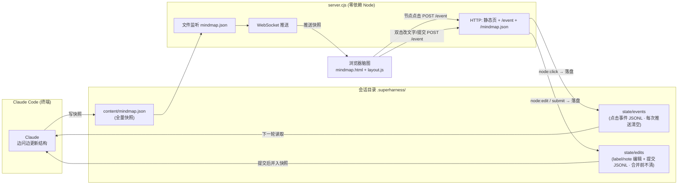

服务器对 `POST /event` 按消息 `type` 分流：`node:click` 写 `state/events`（每次推送
新快照时被清空，所以待处理的点击总是对应当前屏幕）；`node:edit` 与 `submit` 写
`state/edits`（**快照推送不清它**，持续到 Claude 合并后才清），两条管道互不干扰。

### 8.2 一次交互的时序

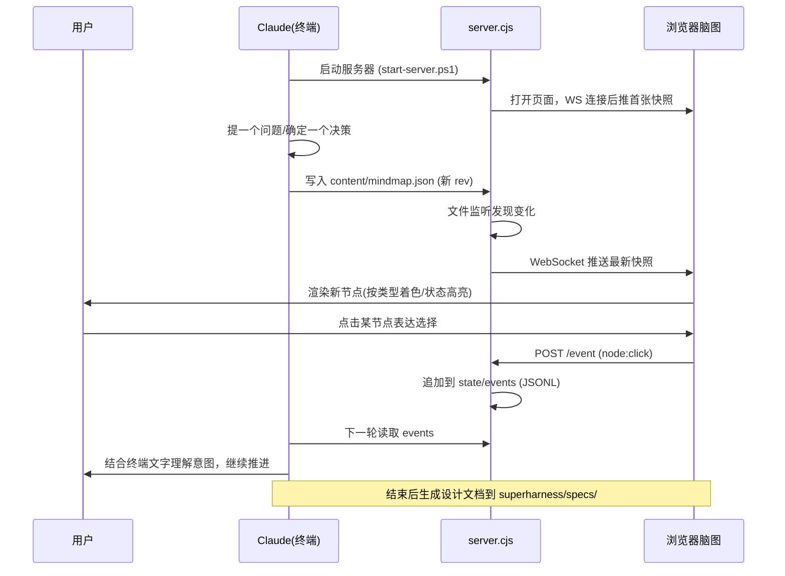

### 8.3 节点编辑：浏览器改文字、提交后并入设计

除了"点节点表达选择"，用户还能在浏览器里**直接编辑节点的 `label`/`note`**，把改动
**批量提交**回 Claude 并入设计——让脑图从"只读投影"变成"可回写的协作画布"。

**前端（`mindmap.html`）**：双击节点弹出编辑面板（label 输入框 + note 文本框），保存
后记入本地 `pendingEdits`（`id → {label, note}`），并 `POST /event` 发一条 `node:edit`；
顶栏「提交 (N)」按钮显示待提交条数，点击后发一条 `submit`。保存即**乐观更新**：界面立刻
显示新文字，但这层覆盖**一直保留到 Claude 合并后的权威快照到达**（在 WS 收到更高 `rev`
的快照时由 `clearPending()` 清除），提交按钮只锁定为「已提交，等待合并…」，绝不自己抹掉
覆盖，否则会在等待期把标签闪回旧值。

**协议（`state/edits` JSONL）**：

```json
{"type":"node:edit","id":"q1-a","label":"新标签","note":"新备注","timestamp":...}
{"type":"submit","timestamp":...}
```

只有 `label`/`note` 可编辑；同一 `id` 后写覆盖先写。

**Claude 侧的编辑轮（SKILL.md）**——这是一段**阻塞式握手**，关键在次序：

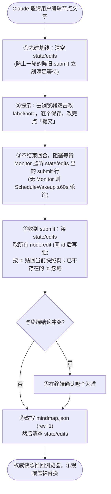

**为什么"先清基线再邀请"**：清空 `state/edits` 必须发生在邀请**之前**，否则上一轮残留
的 `submit` 行会让本轮的等待瞬间被满足（假提交）；同理还堵住了"用户手太快、submit 落在
还没开始 watch 的窗口"。`events` 与 `edits` 分两个文件、且 `edits` **不随快照推送被清**，
正是为了让乐观覆盖在整段等待期内稳定存在。

### 8.4 关键设计

- **消息协议**：Claude → 前端走"写全量快照文件"（含 `rev`/`status`/树形 `root`），
  服务器监听文件变化后 WebSocket 推送；前端 → Claude 走 `POST /event` 落盘 JSONL
  （`node:click` 进 `events`，`node:edit`/`submit` 进 `edits`），Claude 下一轮读取。
  两端通过**文件**解耦，无需复杂双向 RPC。
- **零依赖**：`server.cjs` 自己用 Node 原生 `http` + `crypto` 手写了 WebSocket
  握手与帧编解码（RFC 6455），不装任何 npm 包。
- **自动降级**：没有 Node 时流程退回纯终端脑暴，绝不阻塞。
- **自动退出**：空闲超时（默认 30 分钟）自动关闭，端口随机选取。
- **会话产物**：落在 `.superharness/`（已 `.gitignore`），不污染仓库。

---

## 9. 技术选型与目录

| 部分 | 技术 | 为什么 |
|------|------|--------|
| 安装器 / 钩子 | PowerShell | 目标平台 Windows，免额外运行时 |
| CLI 入口 | `.cmd` 批处理 | cmd / PowerShell 均可直接调用 |
| 脑图服务器 | Node 原生（零依赖）| 免 npm install，开箱即用 |
| 前端脑图 | 纯 HTML + JS（`layout.js`）| 无构建步骤，确定性布局 |
| 插件机制 | Claude Code 本地 marketplace | 项目自带、信任即用，无需全局安装 |

```
superharness\
├── bin\superharness.cmd          # CLI 入口（PATH 上可直接调用）
├── lib\install.ps1               # 安装器逻辑（可测试）
├── template\                     # 被拷进项目的 .claude/superharness
│   ├── .claude-plugin\marketplace.json
│   └── plugins\superharness\
│       ├── .claude-plugin\plugin.json   # 插件清单（superharness: 命名空间）
│       ├── HARNESS.md                   # 会话注入的约束规则
│       ├── hooks\                       # SessionStart + UserPromptSubmit + Stop 钩子
│       ├── scripts\ralph-lib.ps1        # Ralph 状态库（go 跟踪 + 重试，钩子 dot-source 它）
│       ├── skills\                      # go + brainstorm + using-git-worktrees + subagent-driven-development + 5 个核心技能
│       └── stacks\                      # 6 份技术栈指引（可选）
├── tests\run-tests.ps1           # 安装器/钩子测试（PowerShell）
├── tests\*.test.mjs              # 脑图服务器/布局测试（node --test）
├── setup.cmd / setup.ps1         # PATH 一次性配置
└── README.md
```

---

## 10. 测试策略

项目自身按 TDD 构建，两套测试：

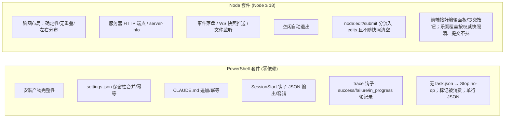

运行命令：

```cmd
:: 安装器 + 钩子
powershell -NoProfile -ExecutionPolicy Bypass -File tests\run-tests.ps1

:: 脑图服务器 + 布局
node --test tests\
```

---

## 11. 环境要求

- **Windows**（安装器与钩子为 PowerShell 实现）
- **Node ≥ 18**（仅 `/superharness:brainstorm` 脑图服务器需要；其余功能不依赖）
- **Claude Code ≥ 2.1.x**（本地 marketplace 插件机制）

---

## 12. 一图总览（从安装到干活）

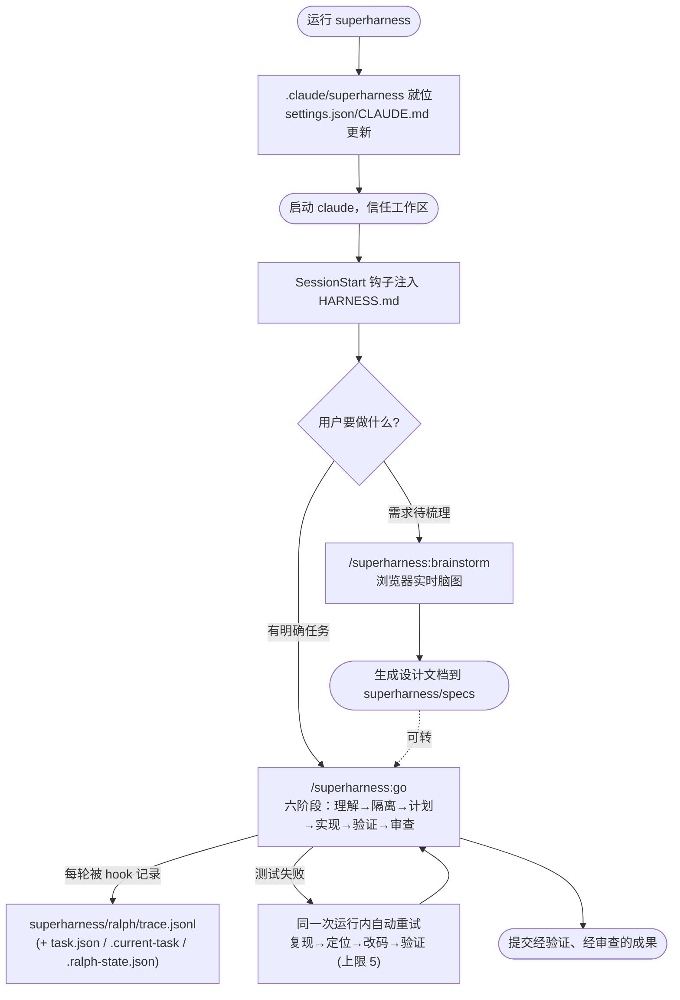
